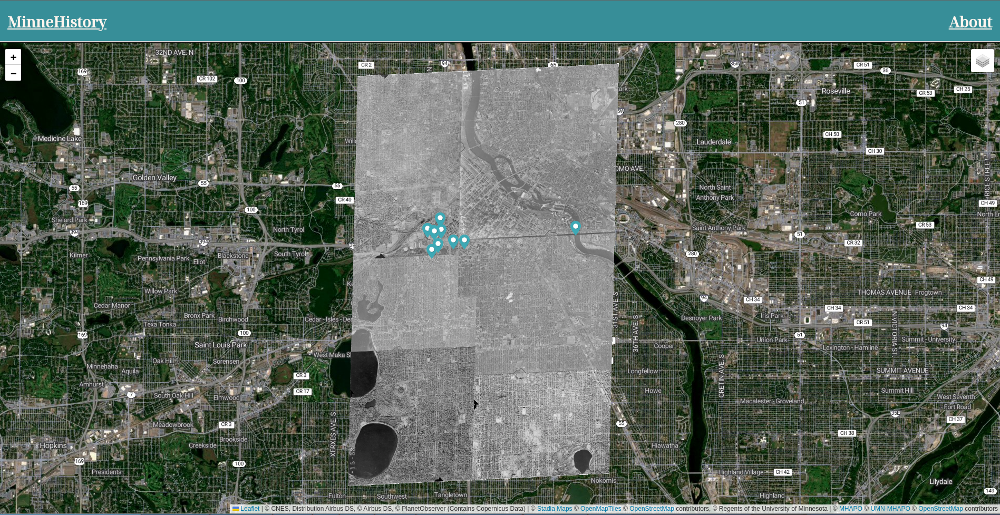

# minnehack-2025
Our minnehack 2025 project.

Members:
Jackson Dempsey
Duncan Murphy
Bruk Kassie
Jason Guerra

## Minnehistory

*"To know the future, you must understand the past."*

Over the past decade, recognizing historical value in how communities have been represented has been essential to moving forward and changing our day-to-day lives for the better. By getting a stronger idea of how our cities and neighborhoods *used* to be structured, we can have a fuller perspective on the places we live in, and take pride in building the future we want to see in future generations! For this, we have a solution close to home: **MinneHistory**.

MinneHistory takes a modern-day GIS display and shows a stitched collection of *30* different maps from the 50s! With the map overlay, you can see images of **prime** areas where there have been *huge* transitions in urban planning and demographics of the different areas of Minneapolis. 

The stitched historical map of Minneapolis is interesting and has been provided under https://github.com/jastintime/minnehack-2025/releases/tag/images this contains the photoshop file of the different images stiched together, the rectangular cropped image used by the program and the most complete stitched image which we made.

### With MinneHistory, you can explore what life *was*, and imagine what life could *be*.

# How to Run
Pre-compiled binaries are not provided, running minnehistory requires the go compiler which can run the program using `go run .`,if you would like to run it outside of the development environment `go build` will build an executable which can run minnehistory as long as it can find database.json, images/, statics/ in its working directory.

# Technical Implementation

Our project is composed of a golang backend with pure javascript and css on the frontend. To build the historic aerial shot of Minneapolis we had to compose and edit over 30 aerial shots from the 50s to get them to align properly and match the current streets to stitch a large aerial shot of Minneapolis. We felt that building this historic aerial shot was important to show the most important change that has occured to the streets of  Minneapolis and it's urban form, the construction of I-94 and I-35W. These projects along with auto-centric infastructure led to a drastic change to the historic downtown and surrounding communites of Minneapolis. Our map is drawn by the open-source Javascript library Leaflet and all the data collection for different spots that have changed throughout Minneapollis was done by hand.

# Credits

* Many thanks to the University of Minnesota and its Map Library, the University of Minnesota makes aerial shots available of Minnesota going as far back as the 1920s https://apps.lib.umn.edu/mhapo/
* Openstreetsmaps for providing the GIS data https://www.openstreetmap.org/#map=4/38.01/-95.84
* Stadiamaps for providing the satelite images of the present https://docs.stadiamaps.com/map-styles/alidade-satellite/
* Thanks to the go team for developing a fun to use programming language https://go.dev/ as well as the gin team for their router https://gin-gonic.com/
* Leaflet for providing a library to work with interative maps https://leafletjs.com/
* Hennepin County Library's digital photo archives for providing many historical photos used in the project, along with relevant adresses and dates for each photo https://digitalcollections.hclib.org/digital/custom/topics 

